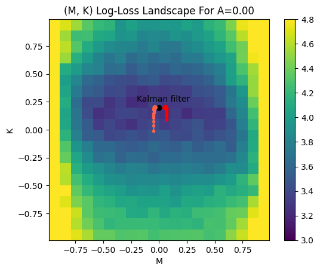

# CMU Summer 2024 uPNC Project

Written by Eric Tao, last updated 2024-06-17

## Table of contents

* [Introduction](#introduction)
* [Setup](#setup)
    * [Task](#task)
    * [Theory](#theory)
    * [Model](#model)
* [Week 1 summary](#week-1-summary)
    * [Exploration 1](#exploration-1)
        * [Hidden Markov process](#hidden-markov-process)
        * [Kalman filter](#kalman-filter)
        * [Recurrent neural network](#recurrent-neural-network)
    * [Exploration 2](#exploration-2)
        * [One-dimensional loss landscape](#one-dimensional-loss-landscape)
    * [Week 1 future directions](#week-1-future-directions)
* [Week 2 summary](#week-2-summary)
    * [Exploration 3](#exploration-3)
    * [Week 2 future directions](#week-2-future-directions)
* [Week 3 summary](#week-3-summary)
    * [Exploration 4](#exploration-4)
        * [One Dimension, One Neuron](#one-dimension-one-neuron)
        * [Two Dimensions, Two Neurons](#two-dimensions-two-neurons)
        * [Three Dimensions, Three Neurons](#three-dimensions-three-neurons)

## Introduction

This is the repository I have made for the code I have written as part of the Summer 2024 uPNC (Undergraduate Program in Neural Computation) at CMU (Carnegie Mellon University). The aim of this project is to investigate the functional basis of why neurons are connected in the patterns that they are. For example, [previous work](https://bmcbiol.biomedcentral.com/articles/10.1186/1741-7007-2-25) by Reigl et al., 2004 has found that certain types of network motifs such as bi-directionally connected pairs of neurons and transitive triangles of neurons are overrepresented inside a *C. elegans* brain. How does the presence of these motifs in a neural network change its ability to perform various tasks? What tasks do networks with these motifs excel at? What tasks do networks with these motifs fail at? The answers to these questions would yield insight into the evolutionary goals of the brain and bridge the gap between network connectivity and functionality, analogous to Marr’s implementational and computational levels.

The main notebook file for my exploration is `LDS_exploration.ipynb`, which depends on the `.py` files in the parent directory. For posterity, I have also included some old unused code in the `old` folder which uses PyTorch. I have since decided to code the system from scratch for a better understanding of the internals and more flexibility.

[Back to top](#top)

## Setup

### Task

Suppose we have hidden variable states $x_0, x_1, x_2, \dots \in \mathbb R^n$ which evolve over time according to a linear dynamics rule $x_t = Ax_{t-1} + w_{t-1}$, where $A \in \mathbb R^{n\times n}$ is the matrix determining the dynamics and $w_t \sim \mathcal N(0^n, \Sigma_\text{process}^{n\times n})$ is IID process noise.

At each time $t$, we then make an observation $y_t \in \mathbb R^m$ which is determined by $x_t$ according to $y_t = Ox_t + v_t$ for some observation matrix $O \in \mathbb R^{m\times n}$ and some IID observation noise $v_t \sim \mathcal N(0^m, \Sigma_\text{obs}^{m\times m})$. For simplicity, we shall take $m=n$ and $O$ to be the identity matrix.

In other words, we have a hidden Markov process where both the state transitions and observations are linear, with Gaussian noise.

The task we would like to accomplish is to take in a series of observations $y_0, \dots, y_T$ as an input and use them to calculate an output $\hat x_0, \dots, \hat x_T$, minimizing the error $\|x-\hat x\|_2$.

[Back to top](#top)

### Theory

The optimal estimator for this task (in the sense of minimizing mean squared error) is known as the Kalman filter and leverages Bayesian inference to combine a prior guess $P(x_t \mid y_1,\dots, y_{t-1})$ with a likelihood $P(y_t \mid x_t)$ to obtain a posterior guess $P(x_t \mid y_1,\dots,y_t)$. The result is that the mean of the posterior distribution will be a linear combination of the guess resulting from the mean of the prior distribution and our new observation:

$$\hat x_t = A\hat x_{t-1} + K_t(y_t - OA\hat x_{t-1}),$$

where $K_t \in \mathbb R^{n\times m}$ is known as the Kalman gain matrix and represents how much we trust our new observation compared to how much we trust our previous guess.

The Kalman gain has its own evolution equation (which depends on the system parameters $A,\Sigma_\text{process},O,\Sigma_\text{obs}$, but not on $x_t$, $y_t$, or $\hat x_t$), but the steady-state value of the Kalman gain $K_\infty$ (which $K_t$ converges to under some reasonable assumptions) is given by the equation

$$K_\infty = \Sigma_\infty O^T (\Sigma_\text{obs} + O\Sigma_\infty O^T)^{-1},$$

where $\Sigma_\infty \in \mathbb R^{n\times n}$ is the steady-state covariance of the estimated latent state and can be calculated by solving the discrete Riccati equation

$$\Sigma_\infty = A(\Sigma_\infty - \Sigma_\infty O^T(O\Sigma_\infty O^T + \Sigma_\text{obs})^{-1}O\Sigma_\infty)A^T + \Sigma_\text{process}.$$

Since we are taking $O$ to be the identity, we can simplify this to obtain

$$K_\infty = \Sigma_\infty (\Sigma_\text{obs} + \Sigma_\infty)^{-1},$$

and

$$\Sigma_\infty = A(\Sigma_\infty - \Sigma_\infty(\Sigma_\infty + \Sigma_\text{obs})^{-1}\Sigma_\infty)A^T + \Sigma_\text{process}.$$

For more information, see [this tutorial](https://compneuro.neuromatch.io/tutorials/W3D2_HiddenDynamics/student/W3D2_Tutorial3.html) introducing the Kalman filter and [these lecture slides](https://www.cs.cmu.edu/~motionplanning/papers/sbp_papers/kalman/kleeman_understanding_kalman.pdf).

[Back to top](#top)

### Model

Drawing inspiration from a neural net, I would like to compute the optimal output to the task using a set of $\ell$ neurons with internal states of $r = (r_1, \dots, r_\ell)$, whose dynamics are governed by the equation $r_t = Mr_{t-1} + Ky_t$ (here, $K$ is analogous to but not the same as the Kalman gain above), where $M \in \mathbb R^{\ell\times\ell}$ and $K \in \mathbb R^{\ell\times m}$. That is, the internal states of the neurons will update according to both the state of the network at the previous time step as well as the new information. Then, our prediction will be a linear function of the neural states: $\hat x_t = Wr_t$, where $W \in \mathbb R^{n\times\ell}$.

[Back to top](#top)

## Week 1 summary

### Exploration 1

#### Hidden Markov process

I first simulated a 3-dimensional linear hidden Markov process with Gaussian process noise and observation noise. An example of such a process is shown below, with $A = \mathop{\mathrm{diag}}(0.98, 0.96, 0.85)$, an initial position of $(100,100,100)^T$, a process noise standard deviation of $10$, and an observation noise standard deviation of $25$.

The dark blue line represents the actual latent state while the orange dots represent the observations collected. One analogy that helps me conceptualize the task is to imagine a cat chasing a bird. The bird’s position in 3-dimensional space is represented by the dark blue lines, with the first dimension representing its $x$ position, the second dimension representing its $y$ position, and the third dimension representing its $z$ position. The bird generally follows a linear dynamical equation, with its current position being a matrix $A$ multiplied by its previous position (in this case, that results in exponential decay in each of the dimensions), but it also wiggles around randomly, depending on the amount of process noise. As the bird flies around, the cat watches it and tracks its position, but its observations (the orange dots) are imperfect, and they always slightly differ from the actual position of the bird (the dark blue line). What is the cat’s best strategy for using the orange dots to reconstruct the actual dark blue line and thereby accurately track the bird’s position and catch it?

[Back to top](#top)

#### Kalman filter

This task has a known optimal solution called the Kalman filter. I implemented a variation of a Kalman filter where the Kalman gain $K$ and estimate transition matrix $M$ are held constant at their steady state values rather than being allowed to vary. I chose to implement the Kalman filter in steady state in order to allow for easier comparison with a linear recurrent neural network, as will be discussed in [the recurrent neural network section](#recurrent-neural-network). I calculated these steady state values numerically by solving a Riccati equation, as detailed in [the theory section](#theory). Its performance at the task is shown below.

The dark blue line is the actual bird’s position and the light blue line is the Kalman filter’s guess for the actual bird’s position. As you can see, it performs remarkably well! I can quantify how well the Kalman filter performs on this task by calculating the sum-of-squares distance between the dark blue line and the light blue line. Letting $x_t$ be the value of the dark blue line at time $t$, $\hat x_t$ be the value of the light blue line at time $t$, and $T$ be the time that I stopped the simulation (in this example, $T=100$), then I can quantify this as
$$\sum_{t=0}^T (x_t-\hat x_t)^2.$$
I’ll make two changes to this formula. First, to make some calculations easier later, I’ll multiply it by a coefficient of $1/2$. This does not really change anything qualitatively. Next, because I am using a steady-state version of the Kalman filter, the Kalman filter parameters will take some time to converge to their theoretical steady-state values. Therefore, instead of starting the sum at $t=0$, I’ll start it at some other time $s$. This gives the formula for the “loss” (or “error”) of the Kalman filter’s estimate for this process:
$$L = \frac12\sum_{t=s}^T (x_t-\hat x_t)^2.$$
Then, we’d like to minimize the expected value of $L$, as averaged over our process and observation noises.

How do we know what value of $s$ to pick? To answer this question, I plotted how long it takes for the Kalman filter parameters to converge to their steady-state values. The results are shown below, with the $y$-axis representing the Frobenius distance between the actual Kalman filter parameters and their steady-state values:

Thus, convergence happens extremely quickly! A value such as $s=5$ should suffice for this process. In the future, it would be a simple task to come up with a formula for a reasonable value of $s$ given the largest eigenvalue of $A$. For example, the time constant for this example process is given by $\tau = -1/\ln(0.98) \approx 49.5$, so a plausible rule of thumb might be to set $s$ to one-tenth of the time constant. However, something unexpected happens when I add in the prediction covariance $\Sigma$ into this plot:

The plot shows that $\Sigma$ converges to a value which is extremely different from its steady-state value. This is puzzling because both $K$ and $M$ are calculated using $\Sigma$, so it is unclear why they would converge to the correct values if $\Sigma$ does not. Investigating this issue is one of my high-priority items for the next week.

[Back to top](#top)

#### Recurrent neural network

Now that the task is well-established and the optimal solution is known, it is an interesting question to ask if we can train a linear fully-connected recurrent neural network to accomplish the same task. The network will be governed by the equations $r_t = Mr_{t-1} + Ky_t$ and $\hat x_t = Wr_t$, where $r_t$ is a vector representing the states of all of the neurons (perhaps the firing rates), $M$ is a connectivity matrix ($M_{ij}$ represents the amount that the state of neuron $j$ at time $t-1$ affects the state of neuron $i$ at time $t$), $K$ is the input gain matrix ($K_{ij}$ represents the amount that dimension $j$ of $y_t$ affects the state of neuron $i$ at time $t$), and $W$ is a readout matrix which transforms the state of the neural network at time $t$ into a prediction for what the value of $x_t$ is. To simplify matters, I’ll assume that the number of neurons is equal to the number of dimensions of our latent state, and I’ll take $W$ to be the identity matrix. Therefore, $\hat x_t = M\hat x_{t-1} + Ky_t$. This is exactly the form of the steady-state Kalman filter, which is why I chose to look at the steady-state form in [the Kalman filter section](#kalman-filter).

Instead of making $A$ a simple diagonal matrix, I set it to be equal to a random matrix with the same eigenvalues as before. Then, I programmed a linear recurrent neural network class which allows for making predictions using given values of $M$ and $K$, testing loss for the current values of $M$ and $K$, and learning $M$ and $K$ through gradient descent. Before thinking about learning, it may be interesting to briefly visualize what the loss landscape looks like. To this end, I simulated the expected loss for neural networks which had the optimal value for $K$ but a value of $M$ which was a linear combination of a random matrix and $M_{\mathrm{opt}}$, the optimal value for $M$. I chose three different random matrices for the purpose of this simulation, so when I plot the expected loss against the Frobenius distance between the chosen value for $M$ and $M_{\mathrm{opt}}$, I expect a pattern of three increasing lines, as moving $M$ farther away from $M_{\mathrm{opt}}$ should make the neural network perform worse. I indeed get this effect:

This graph however muddles two different effects: the loss may be getting worse because I am choosing a value of $M$ which is farther away from the optimal value, or it may be getting worse because our value for $K$ is becoming less and less suited for $M$ as I move $M$ farther away from $M_{\mathrm{opt}}$. A better procedure would be to calculate, for each value of $M$, the best value of $K$ for that value of $M$, and then plot the associated loss. One may think of the purpose of $K$ as scaling the input observations so that the estimator variance matches the input variance and our estimator is unbiased. Once this gain is appropriately calibrated, the variance of the posterior mean should match the variance of the process. Thus, all of the dynamics of interest is controlled by $M$. I will explore this theme more both in a later section where I simulated the loss landscape for a 1D process and in future weeks.

Next, let’s see how learnable the task is. I initialized a neural network with random values of $M$ and $K$ (to be more detailed, each entry was randomly chosen from a Gaussian distribution with mean zero and standard deviation $0.1$, where $0.1$ was chosen so that the states of the neural network would not blow up) and set the initial state of the neurons to be $(100,100,100)^T$, matching the initial state of the hidden Markov process. Before training, the neural network performs very poorly:

However, after 10 descents (with a batch size of 40), it already performs very well on the task:

We can also plot how the loss of the neural network changes over time during training:

As expected, the curve is decreasing and concave up. One could further improve the performance of the neural network over time by adjusting the learning rate as time passes. Finally, we can compare the neural network’s performance to that of a Kalman filter:

Even though the neural network does well, the loss of the Kalman filter is still approximately half of that of the neural network after training.

[Back to top](#top)

### Exploration 2

#### One-dimensional loss landscape

After coding all of the basic foundations of the task, I wanted to get a more detailed understanding of how changing $M$ and $K$ affects the loss function. To do this, I chose to examine a one-dimensional process rather than a three-dimensional process so that $M$ and $K$ would be scalars, and I would be able to plot the value of the loss function as a function of $M$ and $K$ using a simple heatmap. I also decreased the number of time steps from $T=100$ to $T=50$ and allowed $A$ to vary between five different values: $-0.95$, $-0.8$, $0$, $0.8$, $0.95$. I chose to calculate the loss starting from $s=5$. (A more principled approach might change $s$ and $T$ depending on the time constant of the process, determined by $-1/\ln A$. This might be a useful update for a later week.) The below plot shows the log-loss landscape (taking the logarithm here is useful because the loss can get very large very fast) for various values of $M$ and $K$. I also overlaid onto the plot the values of $M_{\mathrm{opt}}$ and $K_{\mathrm{opt}}$ (the steady-state Kalman filter parameters, shown in black), as well as the trajectories of two neural networks during gradient descent (as shown in red and orange, respectively):

When $A=0$, the value of $M$ matters very little while the value of $K$ determines the loss, with the performance being best when $K$ is a small positive number. This makes sense because if $x_t = Ax_{t-1} + w_{t-1}$, then $x_t$ becomes close to zero very quickly when $A=0$, so $\hat x_t$ also becomes close to zero. Since $\hat x_t = M\hat x_{t-1} + Ky_t$, we are multiplying $M$ by a number very close to zero, so the value of $M$ makes very little contribution to the value of $\hat x_t$. On the other hand, we want $K$ to be a small positive number because since the observation noise is bigger than the process noise for this process, $y_t$ will only contain a small amount of information about what the true value of $x_t$ is. Therefore, we want to listen to $y_t$ but not to weight it too much.

On the other hand, when $A=0.95$, the value of $x_t$ remains close to the value of $x_{t-1}$, so we can approximate that $x_t \approx x_{t-1} \approx y_t$. Therefore, since $\hat x_t = M\hat x_{t-1} + Ky_t$, the most important parameter to get correct is the value of $M+K$, which we see reflected in the heatmap because the values with the least loss lie along a line of the form $M+K=c$ for some constant $c$. The loss landscape for $A=-0.95$ is similar but reflected because we would instead expect that $x_t \approx -x_{t-1} \approx y_t$.

For $A=0.8$ and $A=-0.8$, we see a mix between the two extremes, with a plateau around $K$ being a small positive number, as we saw with $A=0$, but the best values for $(M,K)$ lying on a diagonal line.

It is unclear to me how to extend this to higher-dimensional processes. One task worth pursuing here is to figure out how to find the optimal value of $K$ given some value $M$. This is because $M$ is really the variable of interest (how the neurons are connected together), and $K$ is merely a gain which changes the scale. By eliminating $K$ as a variable, it will then be easier to visualize what is going on for higher-dimensional values of $M$.

[Back to top](#top)

### Week 1 future directions

First, there are a few small tasks which need to be completed in order to follow up on the work from week 1.

* Figure out why the Kalman filter covariance matrix does not converge properly.
* Figure out a way to systematically determine the appropriate start time $s$ from the dynamics matrix $A$.
* Figure out a way to calibrate the appropriate value of $K$ given a connectivity matrix $M$.

Then, the next goal I would like to work on is exploring, for small networks, how changing the support of $M$ affects the learnability of the task. To do this, I plan to generate connectivity matrices of various support (which is maintained throughout learning) for networks of a size of $3$ or $4$ neurons. Then, I will compare their loss curves during training and their final performances to see if one connectivity pattern performs better than the other ones. My working hypothesis may be that the patterns which are most common inside *C. elegans* brains will also outperform other patterns with the same number of connections (i.e. the same size of support).

Looking towards the future, I could then compose the small networks together to form larger networks and determine what the most efficient configurations are for solving this task. It may be interesting to view this problem as a form of constrained optimization: given $n$ neurons and $k$ connections, what is the best way to arrange the $k$ connections between the $n$ neurons to minimize the loss? For large $n$, it may be worthwhile to soften the constraint to be continuous rather than binary, introducing an $L^1$ penalty instead. One could also consider greedy algorithms where we start with a fully connected neural network and prune down one-by-one the least useful edges. Alternatively, one could take a bottom-up approach where we start with no connections, and add the most useful connections one-by-one.

Ultimately, I would like to tie this project as best as possible towards realistic cognitive tasks. A neural network with a connectivity matrix with some structure A will most likely be best at inferring from a process whose dynamics are also governed by a matrix with that same structure A. Will it also perform well on processes whose dynamics are governed by a matrix with some other structure B, possibly due to the presence of nonlinearities? How do structure A and structure B correspond to behavioral goals which may be naturally selected for?

It is also important to keep in mind that the network size matters. Many studies take the limit as $n\to\infty$, but there may be effects which are special to networks of medium size, say $n=300$. Are there emergent effects which appear only at certain scales? I will eventually want to start considering nonlinearities in the dynamics, and they may have a large impact on this.

[Back to top](#top)

## Week 2 Summary

### Exploration 3

I essentially just tackled the three bullet points I listed in the [Week 1 future directions](#week-1-future-directions) section this week. The Kalman filter estimate covariance matrix was not converging properly because I was accidentally comparing the *a posteriori* estimate covariance matrices to the steady-state *a priori* estimate covariance matrix. Plotting the distance between the a priori estimate covariance matrices and the steady-state matrix instead works properly, as you can see below with the fixed graph:

Within around 4 time steps, all of the parameters become within 5% of their calculated steady-state values. What happens if we change the dynamics of the hidden Markov process? Does the amount of time required to reach convergence to within 5% change? (Henceforth, I’ll use the term “buy-in period” to refer to the time period after which the parameters remain within a 5% error.)

First, I looked at a hidden Markov process where the latent state was 1-dimensional, so the dynamics were controlled by a single scalar, $A$. I predicted that the length of the buy-in period should be proportional to the time constant of the process, $-1/\ln A$. However, the pattern instead turned out roughly linear, being bounded above by the line $y=11x+2$ (shown in green):

One might wonder if the pattern changes for negative values of $A$, but the graph remains entirely symmetrical about $A=0$. Therefore, a good choice for the length of the buy-in period would be $\lceil 11A+2\rceil$.

The above plot is for a process noise standard deviation of $10$ and an observation noise standard deviation of $25$. Does changing these noise parameters change the required length of the buy-in period? A heatmap for $A=0.99$ and different magnitudes of noise is shown below.

The red line is governed by the equation $y=x/2$. It seems that when the process noise is above half the observation noise, the length of the buy-in period is less than or equal to the length predicted by the previous graph, which is the point $(25,10)$ on this heatmap. Below this line, the length of the buy-in period starts increasing, so it would probably be best to avoid that region in future experimentation so that we can be sure the steady-state Kalman filter is indeed near optimal.

How can we extend this result to multidimensional processes? I tried graphing a plot of the largest eigenvalue of a three-dimensional process and the length of the buy-in period, and it seems that it looks fairly identical to the one-dimensional plot:

Therefore, I can have a reasonable amount of confidence that the same results about the buy-in period will extend to higher-dimensional processes.

I also fixed a bug where the code that numerically solves for the steady-state Kalman filter parameters would sometimes output a faulty covariance matrix, with negative eigenvalues, causing the Kalman filter’s predictions to unexpectedly blow up. I fixed this by choosing a smarter value for the initial guess of the steady-state estimate covariance matrix, and it now works fine.

I was not able to figure out a systematic way to determing the appropriate value of the gain matrix $K$ given the connectivity matrix $M$. I am not sure how to approach that problem.

[Back to top](#top)

### Week 2 Future Directions

My future directions remain largely unchanged from my [Week 1 future directions](#week-1-future-directions). I am going to take a break from attempting to determine the optimal value for $K$ given $M$ and focus on testing out how different connectivity structures perform under gradient descent next week.

[Back to top](#top)

## Week 3 Summary

### Exploration 4

#### One Dimension, One Neuron

This week, I focused on examining what happens to the performance of the neural network when you restrict the support of the connectivity matrix, i.e. eliminate connections between certain neurons. First, I examined the impact of having self-loops in the network. I considered a simple one-dimensional process and a neural network of one neuron, either with a self-loop or without. Then, I let the network undergo gradient descent. As expected, the neuron with a self-loop performed much better at the filtering task than the neuron without a self-loop:

In the first attempt of the experiment, the two bars were actually the same height, but I expect it was because I did not put the training rate high enough and/or did not run the gradient descent procedure for enough iterations. After changing both the training rate and number of iterations, the differences are easy to see, for example by comparing these charts of the loss landscape from those in [the Week 2 findings](#one-dimensional-loss-landscape):

After fixing this issue, the two bars are consistently very different.

[Back to top](#top)

#### Two Dimensions, Two Neurons

A very similar result held true for two-dimensional processes and two-neuron configurations:

That is, the neural networks which had self-loops always performed better than the networks which had fewer self-loops, regardless of what other connections were present. For example, the network whose only connection is a self-loop on one neuron performs the same as the network which has one neuron with a self-loop and a bidirectional connection between the two neurons. Similarly, the network which consists of two neurons with two neurons with self-loops performs much better than the "Loop with bidirectional" network and performs at roughly the same loss as the network with a full number of connections. Another trial only comparing the configurations which have both self-loops in them shows the same trend:

The presence of other connections does not matter! This is surprising because bidirectional connections are overrepresented inside the brain, and I would have expected them to play a similar role as a self-loop but over a larger timescale, allowing for integration of more information over time. These results do make sense though because the matrix governing the process dynamics was mostly diagonal (due to the matrix having eigenvalues 0.8 and 0.9, which are fairly close together), so I would expect a diagonal support matrix (i.e. one only featuring self-loops) to do best and other connections to be irrelevant.

My next idea was to test the same procedure again with a process dynamics matrix which is further away from a diagonal matrix, such as a rotation matrix or a matrix with two eigenvalues which are very far apart. The graph below shows a trial simulated using the process matrix

$$A = \begin{pmatrix}1.032 & -0.076\\ 1.426 & -0.382\end{pmatrix}\quad\text{(eigenvalues $0.95, -0.3$)}$$

which is significantly far from a diagonal matrix:

In this case, the difference between the three conditions is still very small, but the neural network with only two self-loops performs slightly worse than those with additional connections.

Once I tried the process matrix

$$A = \begin{pmatrix}0 & 0.95\\0.8 & 0\end{pmatrix},$$

however, I found that the bidirectional setup performed clearly the best, which makes sense because $A$ is most similar to the adjacency matrix of a bidirectional connection:

Lastly, I tried a rotation-esque matrix
$$A = \begin{pmatrix}0.6&0.8\\-0.8&0.6\end{pmatrix}.$$
At first, the gradient descent process would blow up, but I solved this issue by implementing gradient clipping, limiting each parameter to move by 0.1 at most for each batch. The results were as follows:

We again see the neural network with a bidirectional connection between the two neurons winning over the other configurations by a large margin.

[Back to top](#top)

#### Three Dimensions, Three Neurons

For my experiments involving three neurons, I chose to examine only the configurations which involve every neuron having a self-loop. In addition to performing better, these configurations are more biologically plausible because the state of a neuron at one time point should affect its state at the next time point. Recalling my hypothesis that neural motifs are overrepresented in *C. elegans* because they are better for performing tasks which involve integrating information over time, the transitive triangle configuration should dramatically outperform all other options with six connections (three self-loops and three additional connections). However, after testing the neural networks on a simulated process with eigenvalues $0.6, 0.85, 0.95$, I find no clear evidence that that is the case. The transitive triangle does not seem to have especially less loss than the other configurations, such as the cycle:

Next, I tested a rotation matrix

$$A = \begin{pmatrix}0.6 & 0.8 & 0\\-0.8 & 0.6 & 0\\0 & 0 & 0.9\end{pmatrix}$$

and found that, as expected, the neural network configurations with a bidirectional connection between two neurons performed best:

It is notable that the neural network configuration with a bidirectional connection has four fewer connections than the configuration with all possible connections, but still significantly outperforms it. This is likely due to the fact that even though the capabilities of a more limited network are a strict subset of the capabilities of a fully connected network, the search space for optimal solutions is smaller, so the network with fewer connections has an easier time learning the task than the network with all possible connections.

[Back to top](#top)
